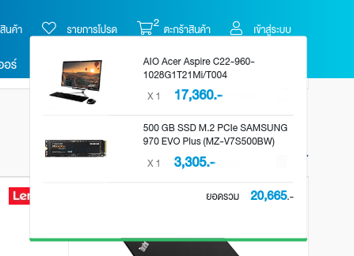

## Front-End Developer

Assume you are awesome Front-End Developer. You have requirements from Product owner that need E-Commerce Platform.

### Features

1. List 10 products in home page with product name, product image, price and "Add to Cart" button

2. When user click at product name or product image. You must redirect to product detail page which show product information.

3. When user click at "Add to Cart" button that product must display in cart pop up + calculate total price (Example Below).

### Technical Details

1. You can use React or Next.js/Angular/Vue (We prefer React and Next.js)

2. Use CSS or SCSS with any framework like Bootstrap, Tailwind, Material-ui

3. Get products data from RESTful API [https://fakestoreapi.com/](https://fakestoreapi.com/)

4. You can write description about your system.

5. Any explaination you can put it in README.md or put it in your code comment.

#### Bonus

You can surprice us with any awesome idea.

---

## Back-End Developer

Assume you are awesome Back-End Developer. Your team lead asking you to implement RESTful API to manage products for E-Commerce Platform + Admin System.

### Features

1. Admin System

1.1 Login Page with Email + Password

1.2 After login redirect to the page that list all products that added from API

2. RESTful API

2.1 build endpoint to list all product.

2.2 build endpoint to get product by id

2.3 build endpoint to create product (name, description, price, image) *** image must be file (multipart/form-data) not the url of the image.

2.4 build endpoint to update product

2.5 build endpoint to delete product

### Technical Details

1. You can use any server side languages (We prefer Node.js).

2. You can use any database you like.

3. Written document (endpoint/headers/request body/response) for RESTful API so we can test it.

4. Any explaination you can put it in README.md or put it in your code comment.

#### Bonus

You can surprice us with any awesome idea.

## How to send

Push your code to your github account and write step to run your application.

PS: It would be great if you use can docker and docker-compose